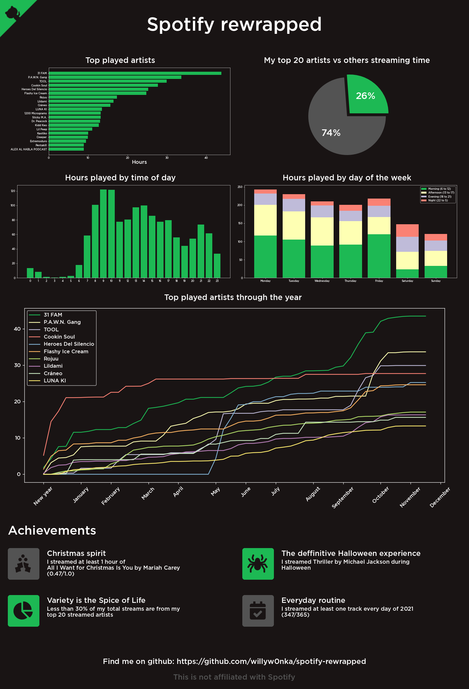

# Spotify Rewrapped

[](https://app.codacy.com/gh/willyw0nka/spotify-rewrapped?utm_source=github.com&utm_medium=referral&utm_content=willyw0nka/spotify-rewrapped&utm_campaign=Badge_Grade_Settings)
[](http://makeapullrequest.com)


Spotify Rewrapped generates an image summing up 2021 from your Spotify data. I got inspired by [this Reddit post](https://www.reddit.com/r/dataisbeautiful/comments/rfkh6r/for_fans_of_spotify_wrapped_you_can_download_your/) and decided to implement my own plots using python.

## Example



## Usage

First of all you need to download your Spotify detailed data from the [Spotify privacy settings](https://www.spotify.com/us/account/privacy/). This process can take up to 30 days to complete.

### On Windows

1.  Download the latest version from the [releases tab](https://github.com/willyw0nka/spotify-rewrapped/releases) on this repo.
2.  Unzip.
3.  Run SpotifyRewrappedGUI.exe
4.  Fill the input path (path where your StreamingHistory.json is located) and the output path (where spotify-rewrapped.png will be generated)
5.  Optionally, fill out your timezone with quotes (otherwise defaults to UTC). [Wikipedia listed timezones under 'TZ Database Name' column.](https://en.wikipedia.org/wiki/List_of_tz_database_time_zones)
6.  Generate

### On Linux

1.  You need to clone this repo (or download as ZIP) and run the python code.
2.  Install python dependencies
    ```bash
    pip install -r requirements.txt
    ```
3.  Run linux.py
    ```bash
    python3 ./linux.py <input_path> <output_path> <timezone>
    ```
    for example:
    ```bash
    python3 ./linux.py /mnt/d/spotify_data /mnt/d/images 'US/Pacific'
    ```

## Contributing

Pull requests are welcome, check CONTRTIBUTING.md for further information.
